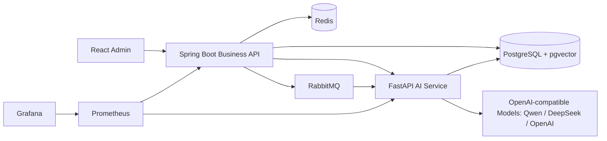

# Enterprise RAG Knowledge Base Platform

这是一个面向企业真实场景和简历展示的 RAG 智能知识库平台 MVP。项目采用 React + Spring Boot + FastAPI 的多服务架构，覆盖文档入库、异步索引、权限过滤检索、多轮问答、Agent Tool Calling、SSE 流式输出、Docker Compose 部署和 Prometheus/Grafana 监控骨架。

## 架构



## 模块

- `frontend`: React + TypeScript + Vite 管理台，包含登录、知识库列表、文档上传、RAG 聊天、流式回答和工具调用时间线。
- `backend-java`: Spring Boot 3 主业务服务，负责登录、RBAC、知识库、文档元数据、RabbitMQ 索引任务、会话和 SSE 聚合。
- `ai-service`: FastAPI AI 服务，负责文档切分、确定性 embedding fallback、权限过滤 RAG 检索、LangGraph Agent 编排和结构化响应。
- `deploy`: Docker Compose、PostgreSQL/pgvector 初始化 SQL、Prometheus 配置和 Grafana 服务。
- `docs`: API、架构说明和简历描述。

## 本地开发启动

### 1. 后端 Java

项目根目录提供 `mvnw.cmd`，固定使用 Maven 3.9.9，避免本机旧 Maven 版本影响构建。

```powershell
$env:JAVA_HOME='C:\Program Files\Java\jdk-17.0.3.1'
$env:Path="$env:JAVA_HOME\bin;$env:Path"
.\mvnw.cmd test
.\mvnw.cmd package -DskipTests
```

运行 Spring Boot：

```powershell
cd backend-java
..\mvnw.cmd spring-boot:run
```

后端地址：`http://localhost:8080`

### 2. AI 服务

```powershell
cd ai-service
conda activate rag-ai
python -m pip install -r requirements.txt
python -m unittest discover -s tests
python -m uvicorn app.main:app --host 0.0.0.0 --port 8000
```

AI API 文档：`http://localhost:8000/docs`

### 3. 前端

```powershell
cd frontend
npm install
npm run build
npm run dev
```

前端地址：`http://localhost:5173`

## Docker Compose 启动

如果在 WSL/Linux 终端中启动，并且当前目录是项目根目录 `/mnt/d/pythonWorkspace/RAG`：

```bash
cp deploy/.env.example deploy/.env
docker compose --env-file deploy/.env -f deploy/docker-compose.yml up --build
```

如果 Docker Hub 拉取镜像超时，编辑 `deploy/.env`，把 `DOCKERHUB_LIBRARY_PREFIX`、`PGVECTOR_IMAGE`、`REDIS_IMAGE`、`RABBITMQ_IMAGE`、`PROMETHEUS_IMAGE` 和 `GRAFANA_IMAGE` 改成当前网络可访问的镜像源。示例已写在 `deploy/.env.example` 中。

`--build` 表示启动前重新构建 `frontend`、`backend-java` 和 `ai-service` 的本地镜像。排错时建议前台运行，能直接看到构建和启动日志；确认可用后可以后台启动：

```bash
docker compose --env-file deploy/.env -f deploy/docker-compose.yml up -d --build
docker compose --env-file deploy/.env -f deploy/docker-compose.yml logs -f
```

停止并清理本次 Compose 启动的容器：

```bash
docker compose --env-file deploy/.env -f deploy/docker-compose.yml down
```

服务地址：

- Frontend: `http://localhost:5173`
- Spring Boot API: `http://localhost:8080`
- FastAPI AI Service: `http://localhost:8000/docs`
- RabbitMQ Console: `http://localhost:15672`
- Prometheus: `http://localhost:9090`
- Grafana: `http://localhost:3000`

如果宿主机端口被占用，可以修改 `deploy/.env` 中的端口变量，例如 `BACKEND_PORT=18080` 会把宿主机 `18080` 转发到容器内 `8080`。

## Demo 账号

- `admin / admin123`: 可访问 HR 和技术架构知识库。
- `analyst / analyst123`: 仅可访问 HR 知识库。

## 已验证

- `.\mvnw.cmd -version`: Maven 3.9.9 + Java 17 可用。
- `.\mvnw.cmd test`: 后端聚合工程构建通过。
- `.\mvnw.cmd package -DskipTests`: 后端 jar 打包通过。
- `conda activate rag-ai; python -m unittest discover -s ai-service\tests`: AI 服务 3 个测试通过。
- `npm run build`: 前端 TypeScript + Vite 构建通过。
- Docker/Prometheus YAML 静态解析通过。

## 简历亮点

- 设计并实现企业级 RAG 知识库平台，支持文档解析、切分、向量化、权限过滤检索、流式问答和 Agent Tool Calling。
- 使用 Spring Boot 承载主业务和权限体系，FastAPI 解耦 AI 检索与模型调用，RabbitMQ 实现异步文档索引。
- 通过 OpenAI-compatible 接口预留 Qwen、DeepSeek、OpenAI 模型切换能力；无模型 Key 时可使用确定性 embedding fallback 跑通 demo。
- 使用 PostgreSQL + pgvector、Redis、RabbitMQ、Prometheus、Grafana 和 Docker Compose 搭建可扩展的企业级架构骨架。
